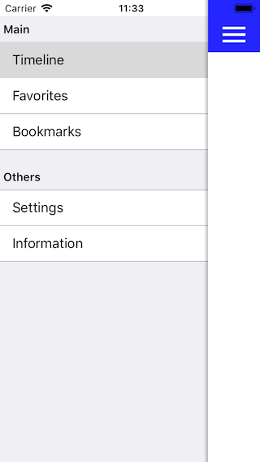

# SideMenuControllerSwift

アプリで良く使われるハンバーグメニューボタンで、スライドするメニューを実装するフレームワーク。
Xcode のプロジェクト一式を登録してあるので、実行すればシミュレータ上で動作確認が可能。


## How to use SideMenuControllerSwift.framework

Xcode の Build Target に SideMenuControllerSwiftXCFramework を指定して Build を実行すると、SideMenuControllerSwift.xcframework が作成される。これを自作アプリの Xcode の Embedded Binaries に設定する。

あるいは、SideMenuControllerSwift フォルダを自作アプリの Xcode の Project に追加する。


## Example



上記のメニューは、以下に示す SMCSideMenu のサブクラスを実装する。

```SideMenu.swift
class SideMenu: SMCSideMenu
{
  override init() {
    super.init()

    self.viewControllerNames = [
      [
        "OneViewController",
        "TwoViewController",
        "ThreeViewController"
      ],
      [
        "FourViewController",
        "FiveViewController"
      ]
    ]
    self.sectionTitles = [
      "Main",
      "Others"
    ]
    self.menuTitles = [
      [
        "Timeline",
        "Favorites",
        "Bookmarks"
      ],
      [
        "Settings",
        "Information",
      ]
    ]
  }
}
```

そして、AppDelegate で window.rootViewController を以下のコードのように記述する。

```AppDelegate.swift
  func application(_ application: UIApplication, didFinishLaunchingWithOptions launchOptions: [UIApplication.LaunchOptionsKey: Any]?) -> Bool {
    // Create full-screen window
    self.window = UIWindow(frame: UIScreen.main.bounds)
    self.window?.backgroundColor = .white

    // Make root view controller
    self.window?.rootViewController = {
      let sideMenu: SideMenu = SideMenu()
      return SMCSideMenuController(delegate: sideMenu, style: .grouped)
    }()

    // Show window
    self.window?.makeKeyAndVisible()

    return true
  }
```

より詳細なコードは SideMenuControllerDemo 内の AppDelegate.swift と SideMenu.swift を見てね。


## Requirements

 - Swift 5
 - iOS 13.6 or later
 - Xcode 12.3 or later


## License Agreement

Copyright (c) 2019-2020, Kouichi ABE (WALL) All rights reserved.

Redistribution and use in source and binary forms, with or without
modification, are permitted provided that the following conditions are met:

 1. Redistributions of source code must retain the above copyright notice,
    this list of conditions and the following disclaimer.

 2. Redistributions in binary form must reproduce the above copyright notice,
    this list of conditions and the following disclaimer in the documentation
    and/or other materials provided with the distribution.

THIS SOFTWARE IS PROVIDED BY THE COPYRIGHT HOLDERS AND CONTRIBUTORS "AS IS"
AND ANY EXPRESS OR IMPLIED WARRANTIES, INCLUDING, BUT NOT LIMITED TO, THE
IMPLIED WARRANTIES OF MERCHANTABILITY AND FITNESS FOR A PARTICULAR PURPOSE ARE
DISCLAIMED. IN NO EVENT SHALL THE COPYRIGHT HOLDER OR CONTRIBUTORS BE LIABLE
FOR ANY DIRECT, INDIRECT, INCIDENTAL, SPECIAL, EXEMPLARY, OR CONSEQUENTIAL
DAMAGES (INCLUDING, BUT NOT LIMITED TO, PROCUREMENT OF SUBSTITUTE GOODS OR
SERVICES; LOSS OF USE, DATA, OR PROFITS; OR BUSINESS INTERRUPTION) HOWEVER
CAUSED AND ON ANY THEORY OF LIABILITY, WHETHER IN CONTRACT, STRICT LIABILITY,
OR TORT (INCLUDING NEGLIGENCE OR OTHERWISE) ARISING IN ANY WAY OUT OF THE USE
OF THIS SOFTWARE, EVEN IF ADVISED OF THE POSSIBILITY OF SUCH DAMAGE.

